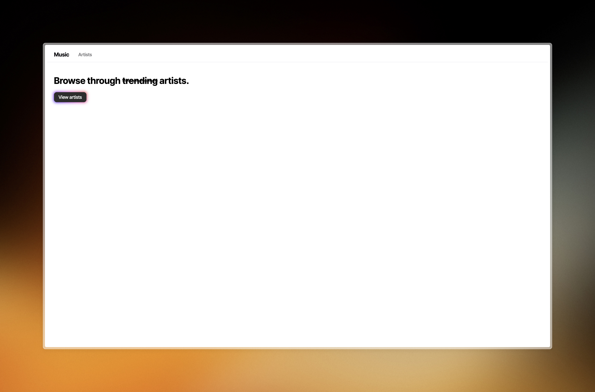
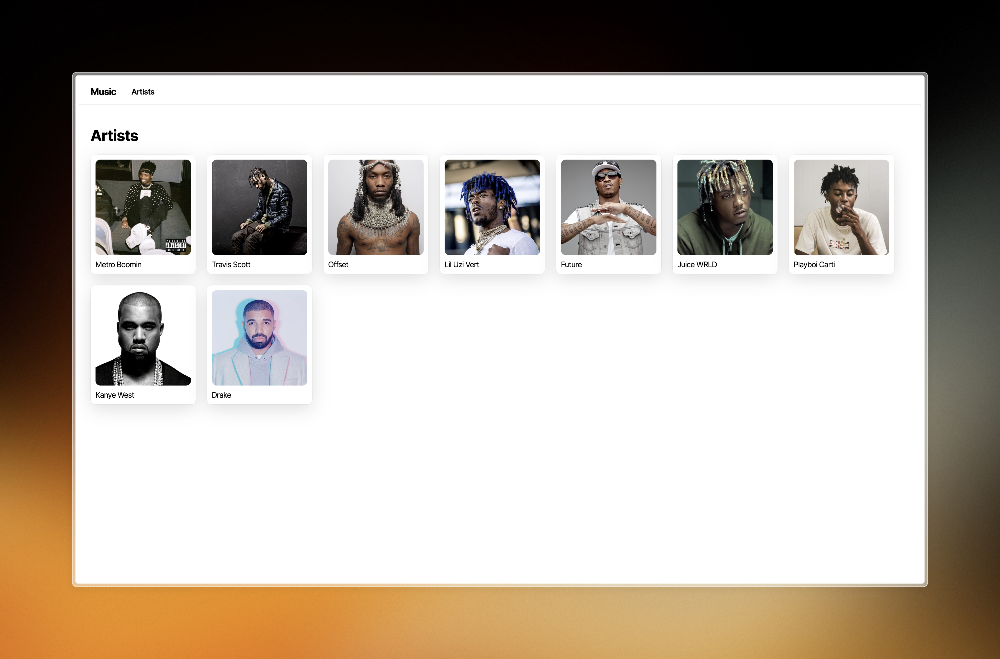
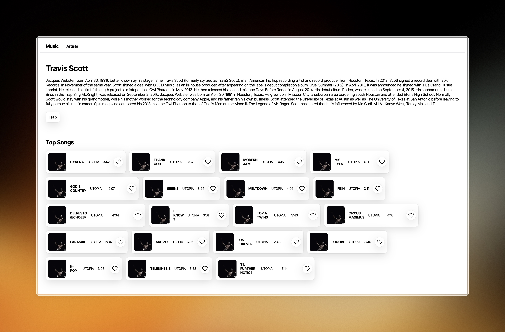

# Music App

The Music App is a front-end application built using React that allows for the viewing of artist profiles.

> [!note]
> Live demo [_here_](https://music-app-react.fly.dev)

## Table of Contents

- [Technologies Used](#technologies-used)
- [Features](#features)
- [Screenshots](#screenshots)
- [Setup](#setup)
- [Usage](#usage)
- [Project Status](#project-status)
- [Acknowledgements](#acknowledgements)
- [Contact](#contact)

## Technologies Used

- React - version 18.2.0
- Vite - version 5.0.5
- ESLint - version 8.53.0
- Node.js - version 18.17.0
- CSS - version 3

## Features

List the ready features here:

- Viewing specific artist profile pages
  - Can view their top songs, and their respective albums, with a simple like system in place.

## Screenshots





<!-- If you have screenshots you'd like to share, include them here. -->

## Setup

Clone the repository and `cd` into the `music-app` directory:

```sh
git clone git@github.com:nine96as/music-app.git && cd music-app
```

Install required `npm` dependencies:

```sh
npm install
```

## Usage

Run the application with:

```sh
npm run dev
```

> [!note]
> The `dev` script will run the app with [Vite](https://vitejs.dev/), which will automatically restart the app when changes are made to the source code.

## Project Status

Project is: _in progress_

## Acknowledgements

- The CSS styling in this project was inspired by [Masudur Rahman](https://dribbble.com/shots/5776583-Light-Music-Artist-Page) and [shadcn/ui](https://ui.shadcn.com/)
- The glow animation stylings in the 'View artists' button came from [CSS Scan](https://getcssscan.com/css-buttons-examples)
- The favicon used was sourced from [icons8](https://icons8.com/icon/set/music/sf-regular)

## Contact

Created by [@nine96as](https://ayo.so/nine96) - feel free to contact me!
